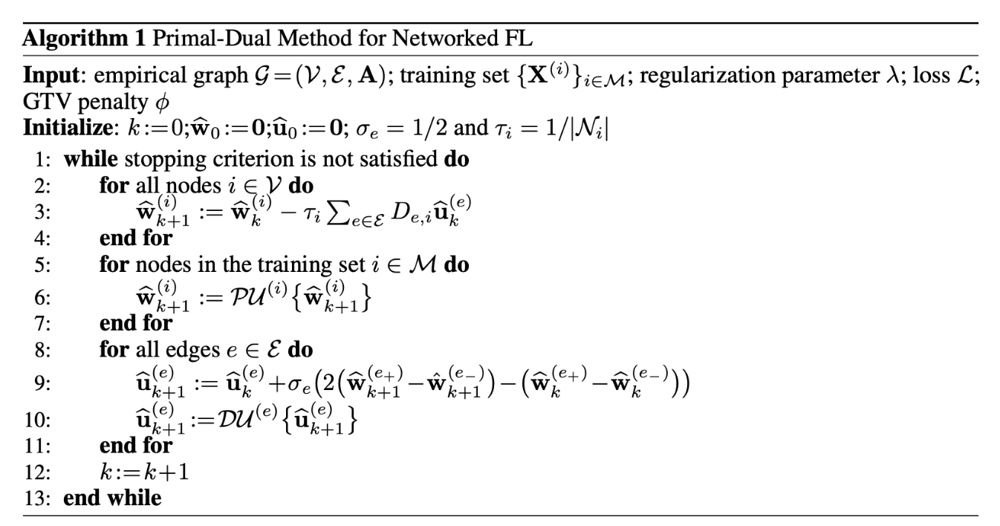

# Network Lasso

This repository includs implementation of some experiments from the following papers [Fedml over networks](https://arxiv.org/pdf/1705.10467.pdf). 


## Requirements
Compute source: standard desktop/macbook,this Algorithm does not need any computational resource. The processor of my macbook is 2,9 GHz Dual-Core Intel Core i5, The memory is 8GB.If you are working with a large network (a large number of nodes/edges), you may need more memory.

To install requirements:

```setup
pip install -r requirements.txt
```


## Experiment

### Stochastic Block Model

* With Two Clusters: This SBM has two clusters C<sub>1</sub> and C<sub>2</sub>.
Two nodes within the same cluster are connected by an edge with probability `pin=0.5`, 
and two nodes from different clusters are connected by an edge with probability `pout=0.01`. 
Each node i &in; V represents a local dataset consisting of 
`m` feature vectors 
x<sup>(i,1)</sup>, ... , x<sup>(i,m)</sup> &in; R<sup>n</sup> . 
The feature vectors are i.i.d. realizations of a standard Gaussian random vector x ~ N(0,1).
The labels y<sup>i</sup><sub>1</sub>, ... , y<sup>i</sup><sub>m</sub> &in; R for each node i &in; V
are generated according to the linear equation y<sup>i</sup><sub>r</sub> = (x<sup>(i, r)</sup>)<sup>T</sup>w&#772;<sup>(i)</sup> +  &epsilon; , 
with &epsilon; &in; N(0,&sigma;), weight vector w<sup>(i)</sup> = (2, 2)<sup>T</sup>
for i &in; C<sub>1</sub>, and w<sup>(i)</sup> = (-2, 2)<sup>T</sup> for i &in; C<sub>2</sub>.
We assume that labels y<sup>(i)</sup> are available for a certain percentage of the graph nodes.
* Results

| Method name                    |  Train MSE      |  Test MSE      |
| ------------------             |---------------- | -------------- |
| algorithm 1, norm1             |    8.27e-06     |     8.73e-06   |
| algorithm 1, norm2             |    8.30e-06     |     8.83e-06   |
| algorithm 1, sq2norm           |    4.94e-05     |     0.0420     |
| plain linear regression        |    4.004        |     4.200      |
| decision tree regression       |    4.115        |     4.764      |


* To reproduce this experiment, please run this notebook:

   [lasso_fedml_sbm_experiment.ipynb](https://version.aalto.fi/gitlab/tiany4/locclusnlassoexperiments/-/blob/master/lasso_fedml_sbm_experiment.ipynb)


## Contributing
This repository is distributed under the MIT License.

